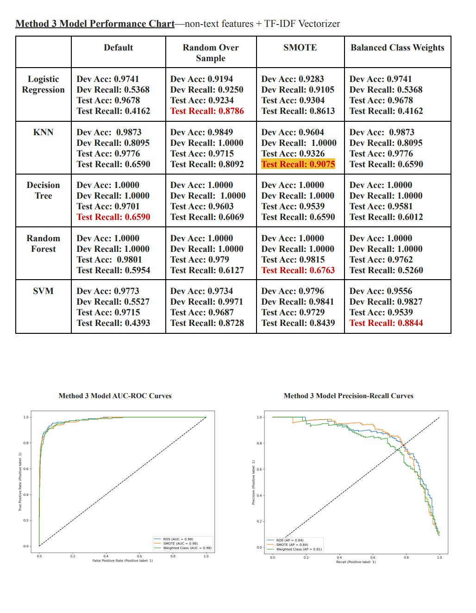

# Final Project: Fake Job Post Detection
- COMS4995 Applied Machine Learning (Spring 2022, Prof. Vijay Pappu)
- Coauthors: **Chaewon (Emily) Park**, Smarth Gupta, Ayush Baral, Erin Josephine Donnelly, Mukesh Bangalore Renuka

## Abstract

Cyber criminals use fake job postings to obtain personally identifiable information (PPI) from unknowing applicants. As students pursuing internships and employment in a job market undergoing circumstantial shifts, we are motivated to identify and avoid dangerous job postings that pose a threat to ourselves, our peers, and many others in their job search. Our core task is predicting the fraudulence of job postings using binary classification models based on job postings’ text features and meta-features extracted from contextual embedding models, and formulating actionable insights as to which description features are most indicative of fraud.

  
  
  
  
  
  

